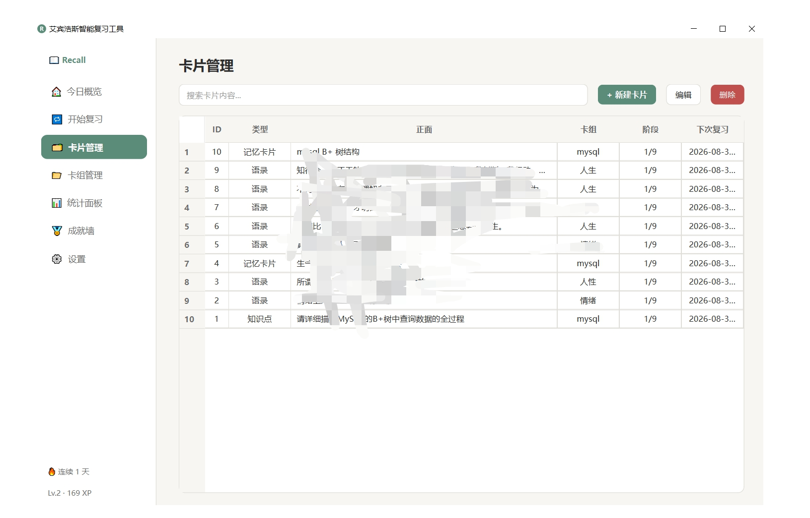
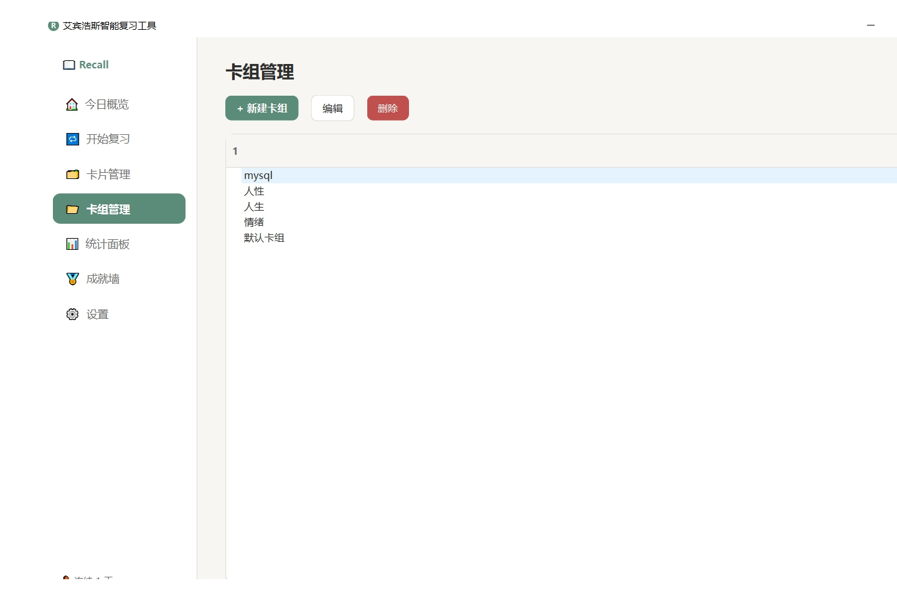
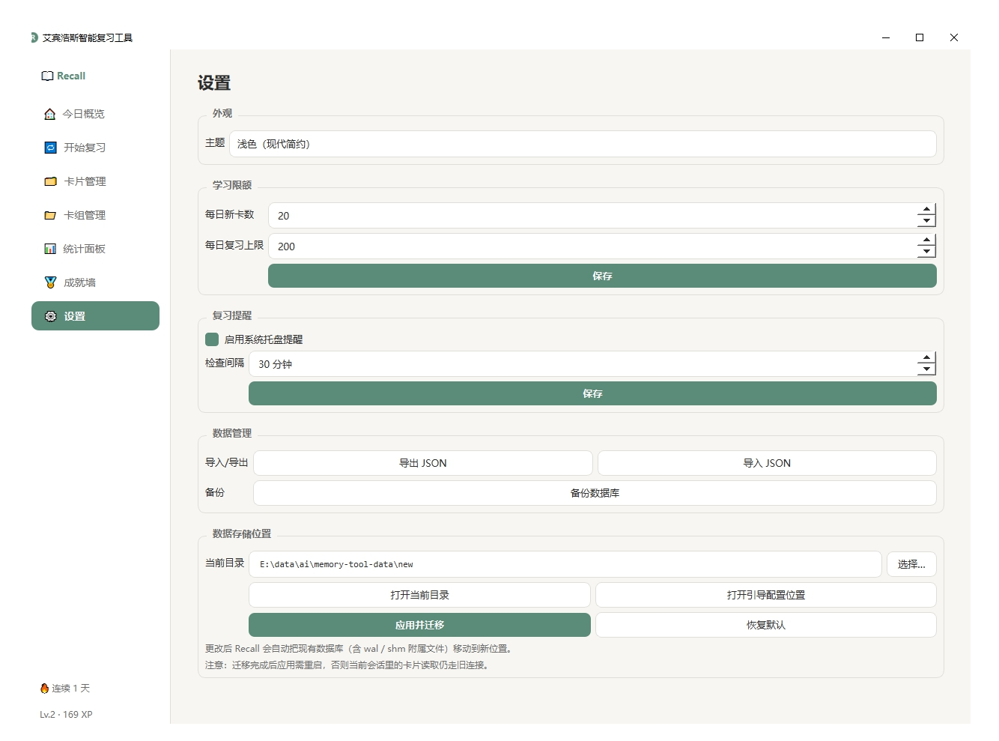
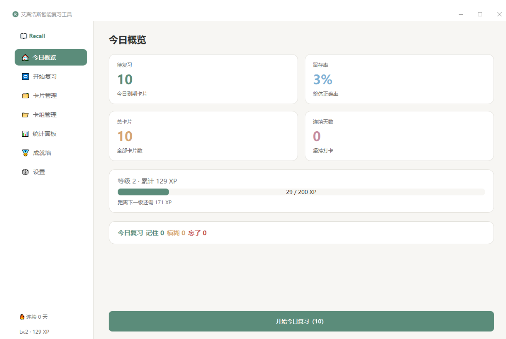

# 📖 Recall — 艾宾浩斯智能复习工具


一款基于 **PySide6** 的桌面应用，通过科学的**间隔重复算法**（艾宾浩斯遗忘曲线）帮助用户高效巩固记忆。支持记忆卡片、知识点笔记、语录收藏三种内容类型，所有内容由算法自动调度复习时间。纯本地运行，数据完全自主可控。

---

## 🖼 截图预览

| 今日概览 | 卡片管理 |
|:---:|:---:|
|  |  |
| 卡组管理 | 设置（自定义数据目录） |
|  |  |

---

## ✨ 功能特性

- **智能复习调度** — 9 阶段递进间隔（5 分钟 → 30 天），结合难度因子（ease）动态微调
- **三级反馈机制** — 记住了 / 模糊 / 忘了，每次反馈自动调整阶段、难度与熟练度
- **熟练度与毕业系统** — 熟练度达 100 自动毕业进入长期记忆池，间隔延长至 60~180 天
- **记忆强度预测** — 基于公式 R(t) = e^(-t/S)，可视化遗忘曲线
- **游戏化激励** — XP 经验值、等级系统、8 种成就徽章
- **数据可视化** — 统计面板展示复习趋势、留存率、阶段分布
- **三套主题** — 浅色 / 深色 / 护眼模式，一键切换
- **定时提醒** — 系统托盘通知，可配置提醒间隔
- **数据导入导出** — JSON 格式完整备份与恢复
- **自定义数据目录** — 跨平台默认路径（APPDATA / Application Support / XDG_DATA_HOME），可在设置中一键迁移到任意位置，自动迁移 SQLite 附属文件

---

## 🛠 技术栈

| 组件 | 技术 |
|------|------|
| UI 框架 | PySide6 (Qt for Python) |
| 数据存储 | SQLite（WAL 模式，连接复用） |
| 图表渲染 | pyqtgraph / matplotlib |
| 运行环境 | Python 3.10+ |
| 打包工具 | PyInstaller |

---

## 📁 项目结构

```
memory-tool/
├── main.py                    # 应用入口
├── review_engine.py           # 复习算法核心（ReviewEngine）
├── database.py                # 数据库连接管理与 Schema 初始化 + 数据目录解析
├── gamification.py            # 游戏化系统（XP / 等级 / 成就）
├── LICENSE                    # MIT 开源协议
├── requirements.txt           # 依赖清单
├── ui/
│   ├── main_window.py         # 主窗口（侧边栏 + 内容区 + 快捷键）
│   ├── dashboard_view.py      # 今日概览面板
│   ├── review_view.py         # 复习模式（卡片翻转 + 反馈按钮）
│   ├── card_manager.py        # 卡片增删改查
│   ├── deck_manager.py        # 卡组管理（支持嵌套）
│   ├── stats_view.py          # 统计图表面板
│   ├── achievements_view.py   # 成就墙
│   ├── settings_view.py       # 设置页（主题/限额/提醒/数据目录/导入导出）
│   └── theme.py               # QSS 主题系统（浅色/深色/护眼）
├── models/
│   ├── card_model.py          # QAbstractListModel 卡片列表模型
│   └── deck_model.py          # QAbstractItemModel 卡组树模型
├── widgets/
│   ├── flip_card.py           # 可翻转卡片 Widget
│   ├── mastery_ring.py        # 熟练度环形进度条
│   └── stat_card.py           # 统计数字卡片组件
├── utils/
│   ├── scheduler.py           # QTimer 定时提醒 + 系统托盘
│   ├── stats.py               # 每日统计与连续打卡天数
│   └── import_export.py       # 数据导入导出（JSON）
└── screenshots/               # 应用截图（README 引用）
```

> **数据文件说明**：`recall.db`（SQLite 数据库）和 `~/.recall_config.json`（数据目录引导配置）**不在项目目录内**，详见下方「数据存储位置」。

---

## 🚀 快速开始

### 方式一：源码运行（开发者）

#### 环境要求

- Python 3.10+
- PySide6 >= 6.5.0
- pyqtgraph >= 0.13.0

#### 安装与运行

```bash
# 克隆仓库
git clone https://github.com/suger-cheng/memory-tool.git
cd memory-tool

# 安装依赖
pip install -r requirements.txt

# 运行应用
python main.py
```

### 方式二：打包为可执行文件（普通用户）

```bash
# 安装打包工具
pip install pyinstaller

# 单目录模式（推荐，启动快）
pyinstaller --onedir --windowed --name Recall main.py

# 或单文件模式（分发方便，首次启动略慢）
pyinstaller --onefile --windowed --name Recall main.py
```

打包产物：
- 单目录：`dist/Recall/Recall.exe` —— 把整个 `dist/Recall/` 文件夹压缩分发
- 单文件：`dist/Recall.exe` —— 直接分发

> 打包后**数据目录自动按系统选择**，无需额外配置；也可在应用设置中自定义路径。

---

## 📂 数据存储位置

Recall 不把数据库放在安装目录，避免升级/卸载时丢失数据。

### 默认路径（跨平台）

| 系统 | 默认路径 |
|------|---------|
| Windows | `%APPDATA%\Recall\recall.db`（即 `C:\Users\<你>\AppData\Roaming\Recall\`） |
| macOS | `~/Library/Application Support/Recall/recall.db` |
| Linux | `~/.local/share/Recall/recall.db`（或 `$XDG_DATA_HOME/Recall/`） |

### 自定义路径 + 自动迁移

在 **设置 → 数据存储位置** 中可以选择任意目录，Recall 会自动：
1. 校验目标目录可写
2. 关闭当前数据库连接
3. 迁移 `recall.db` + `recall.db-wal` + `recall.db-shm`（SQLite WAL 模式的附属文件）
4. 写入引导配置

引导配置文件 `~/.recall_config.json`（放在用户 home 目录，**不在 data_dir 内**——否则改了 data_dir 后下次启动找不到自己在哪）记录当前使用的 `data_dir`。

### 便携版

想把 Recall 放到 U 盘里带着走？在启动前设置环境变量：

```bash
RECALL_BOOT_CONFIG=./boot.json
```

再在设置中把数据目录选成 `./data`，整个 Recall 就可以跟着 U 盘走了。

---

## 🧠 核心算法

### 复习间隔（9 阶段）

| 阶段 | 1 | 2 | 3 | 4 | 5 | 6 | 7 | 8 | 9 |
|------|---|---|---|---|---|---|---|---|---|
| 基础间隔 | 5 分钟 | 30 分钟 | 12 小时 | 1 天 | 2 天 | 4 天 | 7 天 | 15 天 | 30 天 |

实际间隔会根据难度因子 ease（1.3~3.0）做微调：`实际间隔 = 基础间隔 × (ease / 2.5)`

### 三级反馈

| 反馈 | quality | 阶段变化 | ease 变化 | 熟练度变化 | XP |
|------|---------|---------|----------|-----------|-----|
| 记住了 | 2 | +1（最高到第 9 阶段） | +0.08 | +100/9 × (ease/2.5) | +10 |
| 模糊 | 1 | -1（最低到 0） | -0.05 | -5 | +4 |
| 忘了 | 0 | 重置为 0 | -0.3 | ×0.4 | +1 |

### 熟练度与毕业

- 熟练度范围 0~100，达到 100 时卡片**毕业**进入长期记忆池
- 长期记忆卡片使用 60 天基础间隔，按 ease 增长，上限 180 天
- 长期记忆卡片若被标"忘了"，退回普通流程，熟练度降至当前值的 40%

### 复习队列优先级

> 逾期普通卡 > 今日到期 > 即将到期 > 逾期长期卡
>
> 同优先级内按逾期天数降序、ease 升序、熟练度升序排列

---

## 📊 数据模型

| 表名 | 职责 | 核心字段 |
|------|------|----------|
| `cards` | 卡片数据 + 复习调度状态 | stage, ease, mastery, consecutive_correct, is_long_term, next_review_at |
| `decks` | 卡组（支持嵌套） | name, parent_id, new_cards_per_day, review_limit |
| `review_log` | 每次复习操作的完整记录 | feedback, quality, stage/ease/mastery before & after, response_ms |
| `daily_stats` | 按天聚合的统计数据 | cards_reviewed, correct/fuzzy/forgot count, streak_days |
| `settings` | 键值对配置 | theme, daily limits, reminder settings |
| `user_progress` | 用户 XP 与等级 | xp, total_xp, level |
| `achievements` | 成就定义与解锁状态 | code, name, unlocked, unlocked_at |

---

## 🎮 游戏化系统

### XP 与等级

- 升级公式：到达 level n 需要累计 `100 × (n-1) × n / 2` XP
- 等级序列：Lv.1 = 0 XP, Lv.2 = 100 XP, Lv.3 = 300 XP, Lv.4 = 600 XP ...

### 成就列表

| 成就 | 名称 | 解锁条件 |
|------|------|----------|
| `first_review` | 初次复习 | 完成第一次复习 |
| `review_10` | 勤奋学习者 | 累计复习 10 张卡片 |
| `review_100` | 百卡达人 | 累计复习 100 张卡片 |
| `streak_3` | 三日打卡 | 连续学习 3 天 |
| `streak_7` | 一周坚持 | 连续学习 7 天 |
| `perfect_session` | 完美一轮 | 一次复习中全部记住 |
| `long_term_1` | 长期记忆 | 首张卡片毕业进入长期记忆池 |
| `level_5` | 小有所成 | 达到 5 级 |

---

## ⌨️ 快捷键

| 快捷键 | 功能 |
|--------|------|
| `Ctrl+1` | 今日概览 |
| `Ctrl+2` | 开始复习 |
| `Ctrl+3` | 卡片管理 |
| `Ctrl+4` | 卡组管理 |
| `Ctrl+5` | 统计面板 |
| `Ctrl+6` | 成就墙 |
| `Ctrl+7` | 设置 |
| `Ctrl+N` | 新建卡片 |

---

## 🎨 主题

提供三套内置主题，通过设置页面切换：

| 主题 | 配色风格 | 适合场景 |
|------|---------|---------|
| **浅色（light）** | 暖白底 + 灰绿主色 | 日常使用 |
| **深色（dark）** | 深蓝黑底 + 蓝色主色 | 夜间/暗光环境 |
| **护眼（eye）** | 淡黄底 + 绿色主色 | 长时间阅读学习 |

---

## 📦 数据导入导出

- **导出**：全量导出为 JSON 文件（包含卡组、卡片、复习记录、统计、设置、成就）
- **导入**：支持追加导入或全量替换模式
- **备份**：直接在设置中选择备份数据库位置（或手动复制 recall.db）

---

## 📄 License

本项目基于 [MIT 协议](LICENSE) 开源。
